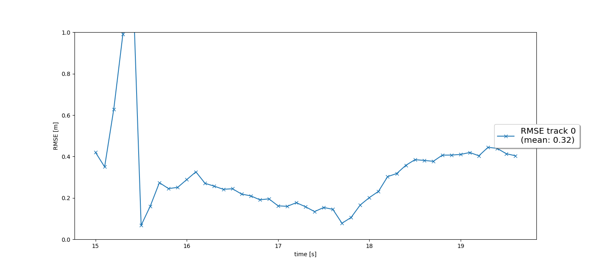
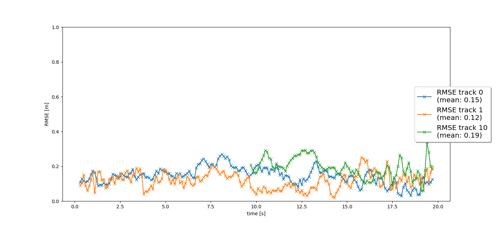
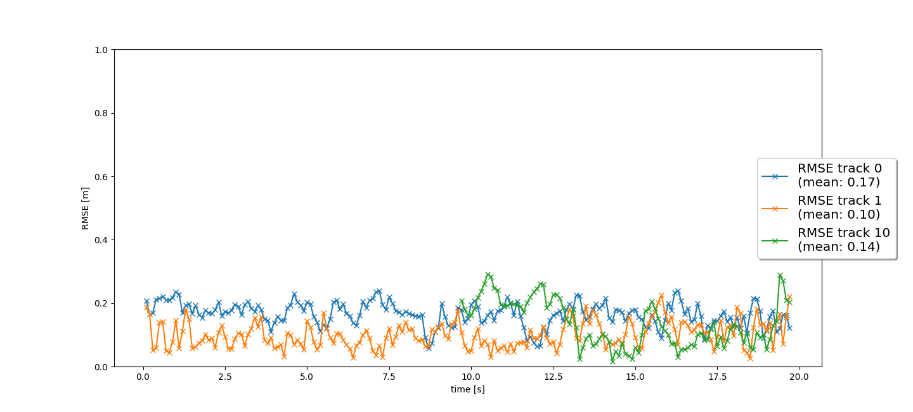
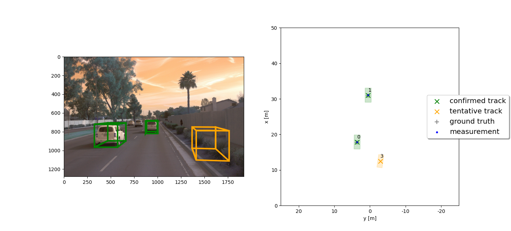

# Writeup: Track 3D-Objects Over Time

Please use this starter template to answer the following questions:

### 1. Write a short recap of the four tracking steps and what you implemented there (filter, track management, association, camera fusion). Which results did you achieve? Which part of the project was most difficult for you to complete, and why?

The projects starts with implementing a simple Kalman filter as Filter class. Covariance matrices are retrieved and predict/update functions are filled.
RMSE is .35 as appears in the following figure:

To enable multi-traking, track management and association are essetial. 

* Track management: This class is responsible for adding/removing tracks and objects to the track list comming from measurments. Dealing with unassigned tracks and deleting old tracks or tracks that are bellow a certain threshold is dealt with. Also adjusting track score for unassigned track is implemented. Also coordinates transformation from/to vehicles is a part of this module.

* Association: Every time a measurment is received and identified, linking objects with previously detected ones is the main part of this module. What follows is the main implemented parts:
  1. Mahalanobis distance is implemented to compute the distance between detected measurements and already available objects in tracks. 
  2. gating function: to reduce the association time complexity.
  3. associate function: to compute the distance between objects in tracks and objects in measurements.

  The following figure shows multi-traking results for lidar data only in terms of root mean squared error (RMSE):
  
  

The last module is camera fusion. In this module, measurements is the target to fill. The following are the main points implemented:
  1. in_fov function: a kind of confirmation, if an object detected in a sensor not seen in the other one, its confidence score is decreased.
  2. Compute the nonlinear camera measurements to be used in kalman filter.

  What follows is the results, RMSE, of multi-target traking using lidar and camera. It can be notices that there is improvents compared to the previous figure.
  
  

### 2. Do you see any benefits in camera-lidar fusion compared to lidar-only tracking (in theory and in your concrete results)? 

What can be detected by lidar might be missed by camera, and vice versa. Therefore, they should complement each other and hence improve tracking results as result, theoritically. 

Even though there are improvments in tracking RMSE, improvements couldn't be observed. The following error in detection couldn't be resolved after fusion:

The examples presented in this project show straight street and a few vehicles. In complext scenarios, data fusion will be more appreciated.

### 3. Which challenges will a sensor fusion system face in real-life scenarios? Did you see any of these challenges in the project?

Calibration and synchronization is challenging. In this project, one lidar and one camera is used. 

Also, adding more sensors will increase the complexity of a sensor fusion system. This will raise a computational challenge.

### 4. Can you think of ways to improve your tracking results in the future?

A tracking system in this context relies on accurate object detection and recognition. Thus first thing is to ensure the detection accuracy.

Instead of using simple association method, other techniqes such as Global Nearest Neighbor (GNN) or Joint Probabilistic Data Association (JPDA) can be used.

Kalman filter is linear, using non-linear tracker would be helpful.

